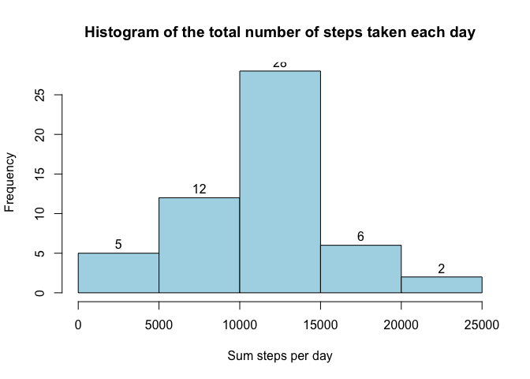
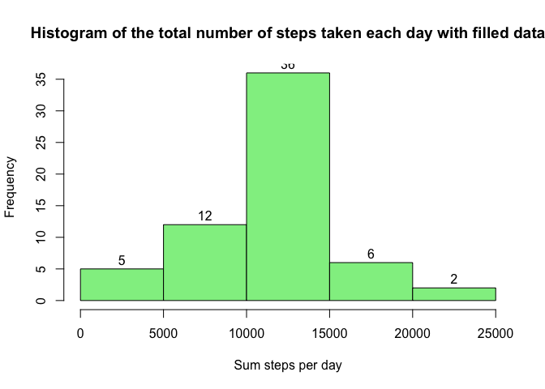
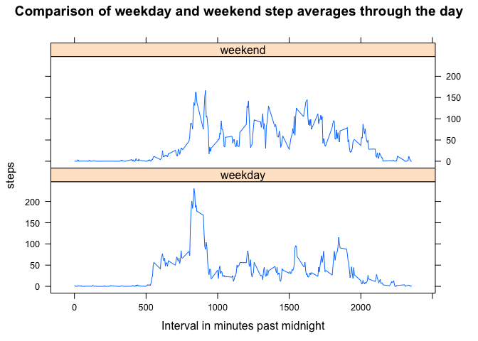

# Reproducible Research: Peer Assessment 1


This file is the completed work from a fork of the following git repository [https://github.com/rdpeng/RepData_PeerAssessment1](https://github.com/rdpeng/RepData_PeerAssessment1). With the following SHA-1 (80edf39c3bb508fee88e3394542f967dd3fd3270).

Bullet points in **bold** are ones that have been set as the assigment, all other text is to explain the approaches taken.

Answers are produced under each code block to show output of functions.

## Loading and preprocessing the data

The file activity.zip was provided as part of the original fork so does not need to be downloaded, just unzipped.  Two data.frames are created to store the activity data in, one has only complete cases.


```r
# unzip the activity.zip file into the current directory
unzip("./activity.zip",exdir="./")

# read the activity.csv file in and define the column classes
activitydata <- read.csv(file = "activity.csv", na.strings="NA",colClasses=c("integer","POSIXct","integer"))

# create a clean data set with the NA's ommitted
activitydata.clean <- na.omit(activitydata)
```

## What is mean total number of steps taken per day?

-  **Make a histogram of the total number of steps taken each day**


```r
# create an array which holds the sum of steps per day
temp<-tapply(activitydata.clean$steps,format(activitydata.clean$date,"%Y-%m-%d"),sum)

# draw the historgram and set the labes for axis and title
hist_raw <- hist(temp,xlab="Sum steps per day",ylab="Frequency", col = "light blue",labels=TRUE,main="Histogram of the total number of steps taken each day")
```

 

- **Calculate and report the mean and median total number of steps taken per day**

Take the variable temp that was created in the previous section which has the total steps per day.  Use the is.na to look for any NAs to remove and then calculate the mean and median.


```r
# calculate the mean and store in variable for reporting and then also display
steps.mean <- mean(temp[!is.na(temp)])
print(steps.mean)
```

```
## [1] 10766.19
```

```r
# calculate the median and store in variable for reporting and then also display
steps.median <- median(temp[!is.na(temp)])
print(steps.median)
```

```
## [1] 10765
```


## What is the average daily activity pattern?

- **Make a time series plot (i.e. type = "l") of the 5-minute interval (x-axis) and the average number of steps taken, averaged across all days (y-axis)**

Using the aggregate function we are able to group the 5 min intervals over the days and compute the average.  This is stored in a new variable for plotting


```r
# find the mean daily pattern for each interval period 
aveDailyPattern <- aggregate(steps ~ interval, activitydata.clean, mean)

# rename the steps column to aveSteps to make it more representative
names(aveDailyPattern)[names(aveDailyPattern)=="steps"] <- "aveSteps"

# plot a line graph of the average daily steps pattern
plot(aveDailyPattern,type="l",ylab="Average steps",main="Average Daily Activity Pattern")
```

 


- **Which 5-minute interval, on average across all the days in the dataset, contains the maximum number of steps?**


```r
# use which.max() to get the row number with the max steps and use this to retrieve the interval from the vector
maxsteps.time <- aveDailyPattern[which.max(aveDailyPattern$aveSteps),1]
print(maxsteps.time)
```

```
## [1] 835
```

```r
#create any date with time as 00:00:00 to add the interval to
d <- as.Date("1970-01-01")
p <- as.POSIXlt(d)
#now print out the time component to show us the max time
format(p + (maxsteps.time*60),"%T")
```

```
## [1] "13:55:00"
```


## Inputing missing values

- **Calculate and report the total number of missing values in the dataset (i.e. the total number of rows with NAs)**

```r
sum(!complete.cases(activitydata))
```

```
## [1] 2304
```

- **Devise a strategy for filling in all of the missing values in the dataset. The strategy does not need to be sophisticated. For example, you could use the mean/median for that day, or the mean for that 5-minute interval, etc. Create a new dataset that is equal to the original dataset but with the missing data filled in. **

To fill in the missing values the data set with the average values for each 5 minute interval will be used.  If there is a NA in the steps value for a given interval, the corresponding 5 minute average value will be used.


```r
# merge the activitydata dataframe and the aveDailyPattern dataframe
# this gives four columns interval,steps,date and aveSteps
# this may then be used for comparison and if there is an NA value in steps use the aveSteps for that interval
filled_data <- merge(activitydata,aveDailyPattern,by="interval")
filled_data$steps[is.na(filled_data$steps)] <- filled_data$aveSteps[is.na(filled_data$steps)]

# order the data set by the date
filled_data <- filled_data[order(filled_data$date),]
```

- **Make a histogram of the total number of steps taken each day and Calculate and report the mean and median total number of steps taken per day. **


```r
# no need to check for any NA values as these were filled in the previous step
# create an array which holds the sum of steps per day
temp_filled<-tapply(filled_data$steps,format(filled_data$date,"%Y-%m-%d"),sum)

# draw the historgram and set the labes for axis and title
hist_filled <- hist(temp_filled,xlab="Sum steps per day",ylab="Frequency", col = "light green",labels=TRUE,main="Histogram of the total number of steps taken each day with filled data")
```

 

- **Do these values differ from the estimates from the first part of the assignment? **

A table is produced to show the difference in the data from the two histograms


```r
# create a dataframe from the histogram data and calculate the difference between the values
# not a subset of the hist$breaks was used as this is always $counts+1.  The upper bound of the breaks was chosen for the table
diff_table <- cbind.data.frame(hist_raw$breaks[2:6],hist_raw$counts,hist_filled$counts,hist_filled$counts-hist_raw$counts)

# give the table some more meaningful names
names(diff_table) <- c("Upper Break #","Raw Data","Filled Data","Filled Data - Raw Data")

# print the values
print(diff_table)
```

```
##   Upper Break # Raw Data Filled Data Filled Data - Raw Data
## 1          5000        5           5                      0
## 2         10000       12          12                      0
## 3         15000       28          36                      8
## 4         20000        6           6                      0
## 5         25000        2           2                      0
```


- **What is the impact of imputing missing data on the estimates of the total daily number of steps?**


```r
# calculate the mean and store in variable for reporting and then also display
steps.mean.filled <- mean(temp_filled[!is.na(temp_filled)])
print(steps.mean.filled)
```

```
## [1] 10766.19
```

```r
# calculate the median and store in variable for reporting and then also display
steps.median.filled <- median(temp_filled[!is.na(temp_filled)])
print(steps.median.filled)
```

```
## [1] 10766.19
```

This shows that the mean remains the same with a slight uplift in the median from the original values


## Are there differences in activity patterns between weekdays and weekends?

- **Create a new factor variable in the dataset with two levels – “weekday” and “weekend” indicating whether a given date is a weekday or weekend day.**

The filled data, dataframe is used for this with a small function to do an ifelse check on the $date column using weekdays(x).  If this matches a value in the vector `c("Saturday","Sunday")` then it will record the value weekend, else it will record weekday.  The result of this is added as a new factor column in the dataframe.


```r
# store the values for weekend days
weekend <- c("Saturday","Sunday")

# now iterate through the the filled_data dataframe and test to see if the weekdays(filled_data$date) is in the weekend vector or not
weekday.weekend <- as.factor(sapply(filled_data$date, function(x) ifelse(weekdays(x) %in% weekend,"weekend","weekday")))

# add this as a new column in the filled_data dataframe
filled_data$dayType <- weekday.weekend
```


- **Make a panel plot containing a time series plot (i.e. type = "l") of the 5-minute interval (x-axis) and the average number of steps taken, averaged across all weekday days or weekend days (y-axis). The plot should look something like the following, which was creating using simulated data:**

This takes the dataframe from the previous chunk and works and an average for the weekday factor and the weekend factor.  These two resulting data frames are then merged together before being put through the lattice library xyplot function to show weekday and weekend averages ontop of each other.


```r
# we will need a two row container to place plots in
par(mfrow=c(2,1))

# create a new average aggregate for weekday
aveWeekDayPattern <- aggregate(steps ~ interval, data=filled_data, FUN=mean,subset=filled_data$dayType=="weekday")
aveWeekDayPattern$dayType <- rep("weekday",nrow(aveWeekDayPattern))

# create a new average aggregate for weekend
aveWeekEndPattern <- aggregate(steps ~ interval, data=filled_data, FUN=mean,subset=filled_data$dayType=="weekend")
# add a column with the 
aveWeekEndPattern$dayType <- rep("weekend",nrow(aveWeekEndPattern))

# merge to a single data frame and plot by dayType factor using lattice library
library(lattice)
data <- rbind(aveWeekDayPattern,aveWeekEndPattern)
with(data,xyplot(steps~interval|dayType,type="l",layout=c(1,2),xlab="Interval in minutes past midnight",ylab="steps",main="Comparison of weekday and weekend step averages through the day"))
```

 

This shows that there is more activity in the morning on a weekday compared to a weekend, with a slightly earlier start on a weekday.
