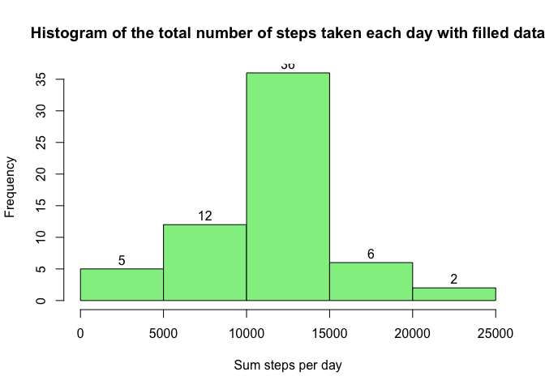
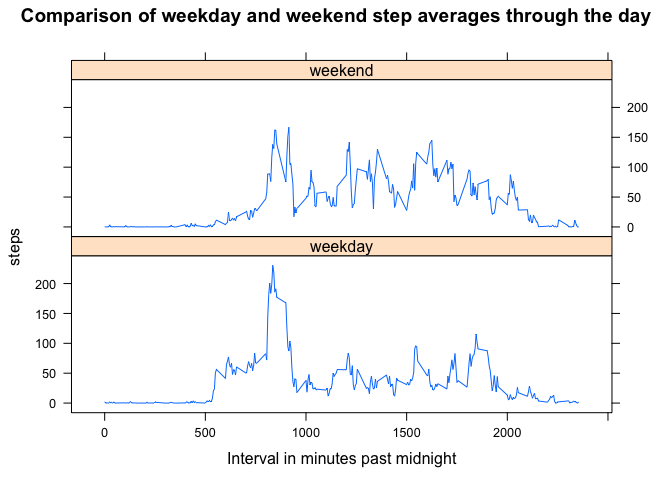

## Introduction

This repository contains the completed work from a fork of the following git repository [https://github.com/rdpeng/RepData_PeerAssessment1](https://github.com/rdpeng/RepData_PeerAssessment1). With the following SHA-1 (80edf39c3bb508fee88e3394542f967dd3fd3270).

## Result Rmd and md files

- [PA1_template.Rmd](PA1_template.Rmd)
- [Results with Output](PA1_template.md)
- [HTML output from KnitR](PA1_template.html) 

## Graphs from figure directory

 

 